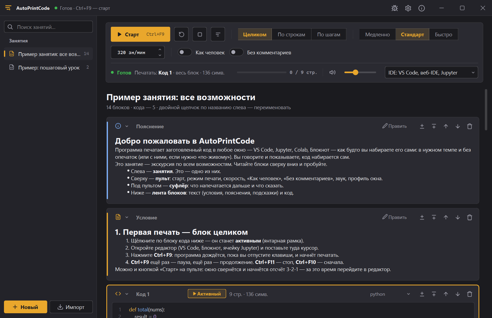
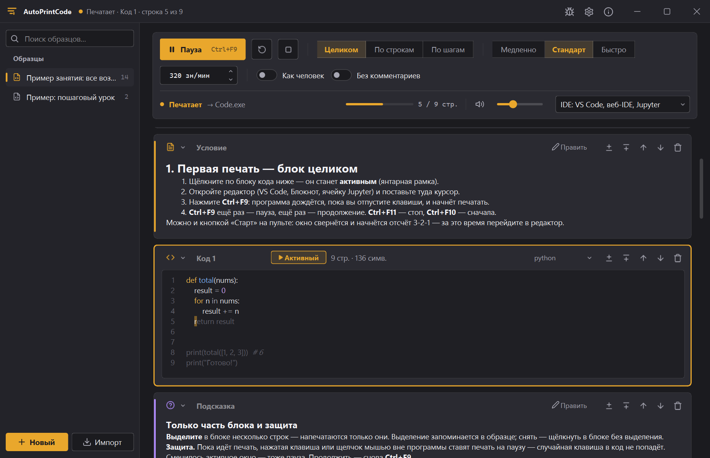
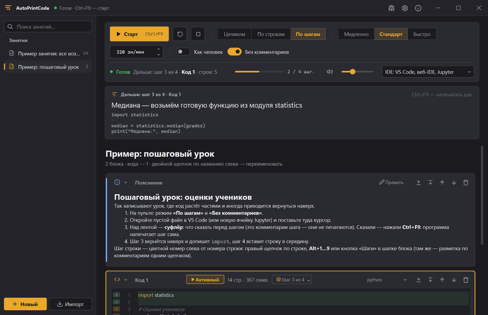
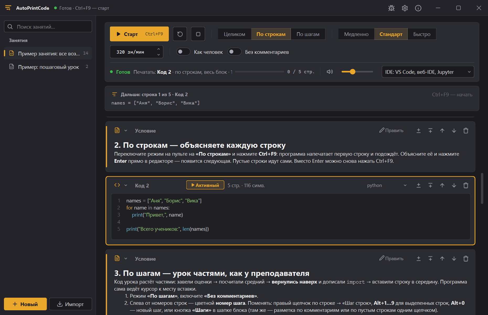
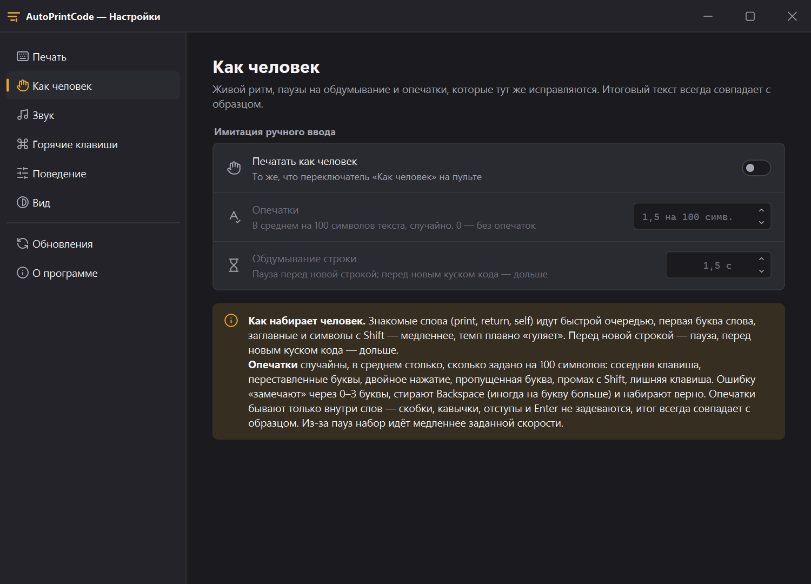
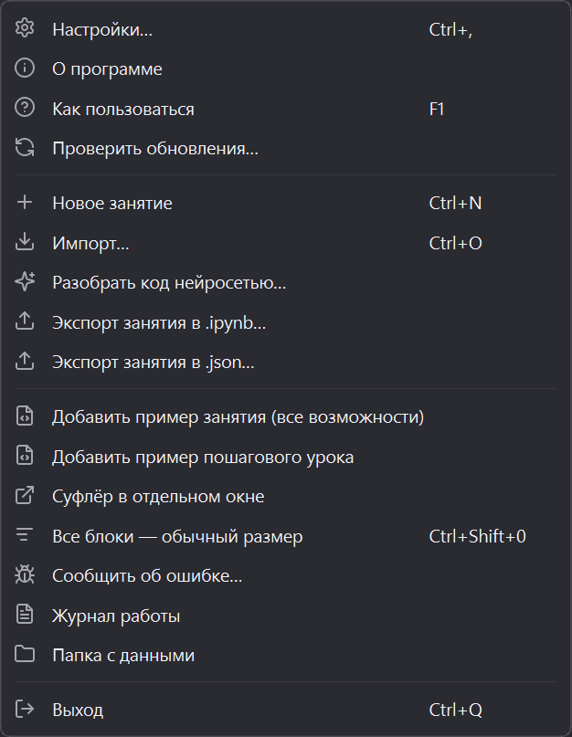
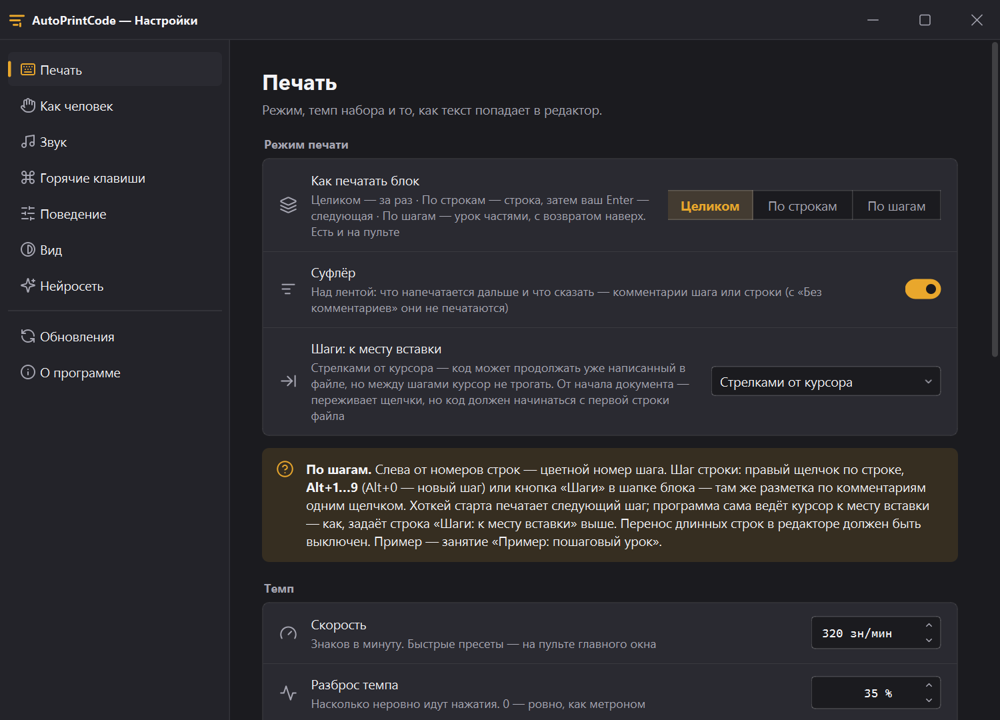
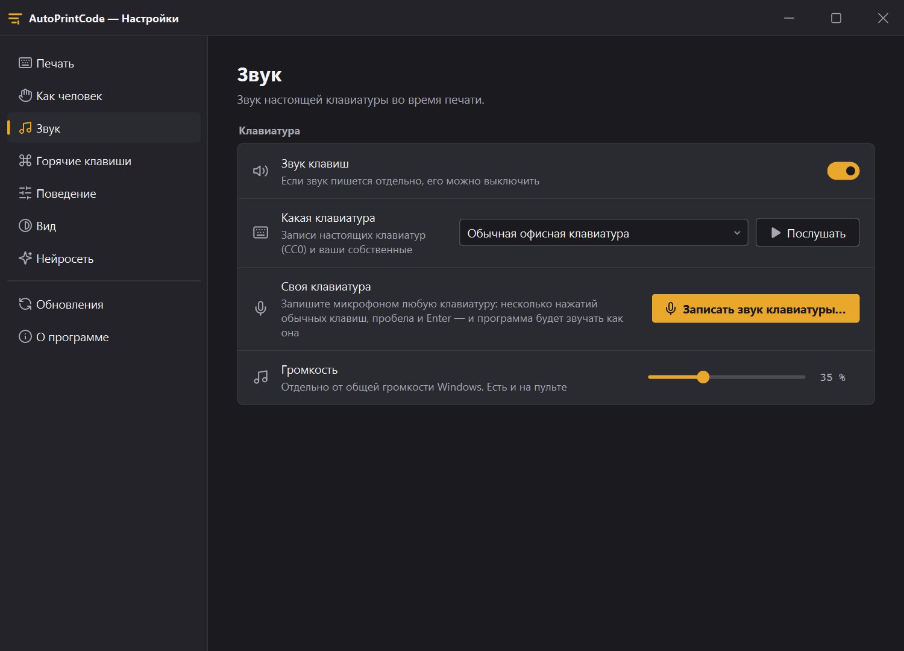
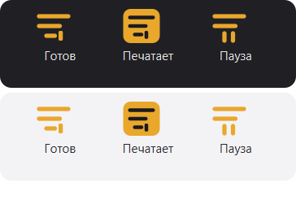
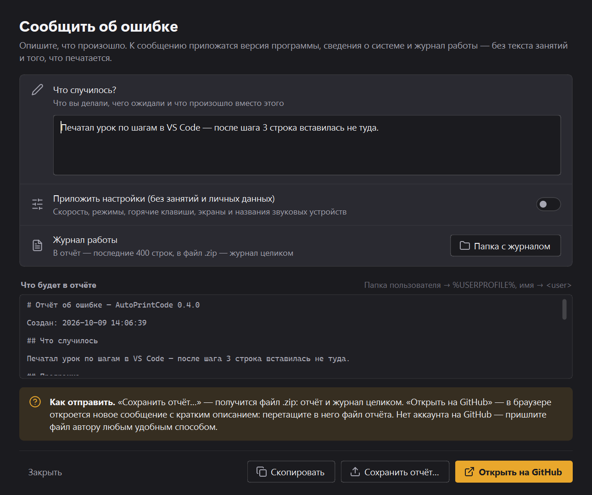

<div align="center">


# AutoPrintCode

**Печатает заготовленный код в любое окно — как будто вы набираете его сами.**

VS Code, Jupyter, Colab, Блокнот — с позиции курсора, без ошибок (или с живыми опечатками),
в заданном темпе и со звуком настоящей клавиатуры. Вы объясняете — код набирается.

[](https://github.com/Recyavik/AUTO_PRINT_CODE/releases/latest)

[](https://github.com/Recyavik/AUTO_PRINT_CODE/releases/latest)
[](#установка)
[](#из-исходников)

<br>

<picture>
  <source media="(prefers-color-scheme: light)" srcset="docs/images/main-light.png">
  
</picture>

<sub>Слева — образцы-занятия, сверху — пульт печати, ниже — лента блоков: условия, пояснения и код.</sub>

</div>

<br>

## Для записи видеогайдов по программированию

Когда записываешь урок, приходится одновременно набирать код, объяснять и следить за кадром.
AutoPrintCode берёт набор на себя:

- **Меньше дублей и монтажа.** Код печатается без опечаток и без пауз на то, чтобы вспомнить
  следующую строку. Фрагмент получается с первого раза, не нужно вырезать ошибки и заминки.
- **Можно говорить, пока код набирается.** Печать идёт сама. Хоткей `Ctrl+F9` ставит её на паузу
  в любой момент, когда нужно что-то пояснить, и продолжает с того же места.
- **Зритель успевает следить.** Код появляется постепенно в заданном темпе, а не вставляется целиком
  через `Ctrl+V`. Скорость подбирается под аудиторию: медленнее для новичков, быстрее для опытных.
- **Выглядит как живое программирование.** Режим «Как человек» добавляет неровный ритм, паузы
  на обдумывание и опечатки, которые тут же исправляются. Звук настоящей клавиатуры поддерживает
  ощущение, что код набирают руками. Если звук пишется отдельно, его можно выключить.
- **Одинаковый темп от дубля к дублю.** Неудачный фрагмент легко переснять кнопкой «Сначала»
  и склеить с остальными: ритм не будет отличаться.
- **Код урока по частям.** Образец — это сценарий: условие, пояснения, подсказки и блоки кода по порядку.
  Печатать можно блок целиком, по строкам (следующая — по вашему Enter) или по шагам, как объясняет
  преподаватель: с возвратом наверх и вставкой в середину. Переход к следующему блоку — `Ctrl+F12`.
- **Чистый код в кадре, конспект — на суфлёре.** В образце можно оставить комментарии-подсказки для себя:
  с «Без комментариев» в редактор попадёт код без них, а суфлёр покажет их крупно — что сказать.
- **Код в кадре — точно как в образце.** Профиль IDE учитывает автоскобки и автоотступы редактора.
  Не придётся исправлять что-то на записи.
- **В настоящих инструментах.** Печать идёт в VS Code, Jupyter, Colab или Блокнот. Урок записывается
  в той же среде, в которой будет работать зритель.
- **Ничего лишнего не попадёт в кадр.** Хоткеи не доходят до редактора. Если сменилось активное окно,
  вы случайно нажали клавишу или щёлкнули мышью, печать встаёт на паузу, а случайная клавиша в код не попадает.
- **Окно программы можно держать вне кадра.** Например, на втором мониторе: всё управление идёт
  глобальными хоткеями.

## Как это выглядит

<table>
<tr>
<td width="50%" valign="top">

<p align="center"><sub><b>Идёт печать.</b> В блоке напечатанное — яркое, текущее место отмечено; на пульте — ход и окно, в которое идёт набор.</sub></p>
</td>
<td width="50%" valign="top">

<p align="center"><sub><b>По шагам.</b> Суфлёр — что сказать перед шагом и какой код появится; у строк — цветные номера шагов.</sub></p>
</td>
</tr>
<tr>
<td width="50%" valign="top">

<p align="center"><sub><b>По строкам.</b> Строка напечаталась — объясняете — Enter в редакторе — следующая.</sub></p>
</td>
<td width="50%" valign="top">

<p align="center"><sub><b>Как человек.</b> Сколько опечаток на 100 символов и сколько думать перед строкой.</sub></p>
</td>
</tr>
</table>

## Установка

### Установщик (рекомендуется)

Скачайте `AutoPrintCode-X.Y.Z-Setup.exe` со страницы [последнего выпуска](https://github.com/Recyavik/AUTO_PRINT_CODE/releases/latest)
и запустите. Права администратора не нужны. Первым делом установщик спросит, как ставить:

- **Установить** — для текущего пользователя в `%LOCALAPPDATA%\Programs\AutoPrintCode` (папку можно
  выбрать): ярлык в меню «Пуск» (и на рабочем столе — по желанию), удаление через «Параметры → Приложения».
  Программа обновляется сама.
- **Обновить установленную версию** — если AutoPrintCode уже стоит: та же папка, без лишних вопросов.
  Образцы и настройки остаются.
- **Портативная версия** — просто папка с программой, например на флешке. В Windows ничего не
  прописывается, образцы и настройки лежат в папке `data` рядом с программой.

Если выбрать папку, куда программа не сможет записывать (например, `C:\Program Files`), установщик
предупредит и попросит другую — иначе не сохранялись бы образцы и не работало бы автообновление.

Windows SmartScreen может предупредить о неизвестном издателе (у программы нет платной цифровой подписи):
«Подробнее» → «Выполнить в любом случае».

### Портативная версия архивом

Там же, в выпуске, лежит `AutoPrintCode-X.Y.Z-win64.zip`: распакуйте куда угодно и запустите
`AutoPrintCode.exe`. Это то же самое, что «Портативная версия» в установщике.

### Из исходников

Нужны Windows и Python 3.10+.

```
git clone https://github.com/Recyavik/AUTO_PRINT_CODE.git
cd AUTO_PRINT_CODE
pip install -r requirements.txt
python app.py        # или run.bat — без консоли
```

Без git можно скачать архив: на странице репозитория **Code → Download ZIP**.

При первом запуске создаётся папка `data/` с образцами-примерами и звуками клавиш. Она не хранится в
репозитории: у каждого своя база образцов и настроек.

**Версия для браузера** — интерфейс открывается страницей, печать идёт через локального помощника
на Node.js: `web\start.bat`. Подробности — в [web/README.md](web/README.md).

## Пример занятия — с него стоит начать

При первом запуске открывается образец **«Пример занятия: все возможности»** — экскурсия по программе.
Блоки в нём идут по порядку: что где на экране, первая печать, печать части блока и защита, режимы
«По строкам» и «По шагам», «Как человек», «Без комментариев» и суфлёр, профили окна, своё занятие,
звук, тема, трей. У каждого раздела — код, на котором это можно сразу попробовать.

Удалили или хотите второй экземпляр — меню логотипа → **«Добавить пример занятия (все возможности)»**.
Тот же образец лежит файлом [`examples/Пример занятия.json`](examples/Пример%20занятия.json):
его можно импортировать (**Импорт** → файл `.json`) или взять за основу своего урока.

## Как устроено

- **Образец** — занятие: лента **блоков** сверху вниз. Блок — это текст (Markdown с ролью: условие, пояснение, подсказка) или код.
- Окно оформлено в стиле PasteTalk: слева **библиотека образцов**, сверху **пульт печати** (старт, режим
  «Целиком / По строкам / По шагам», скорость «Медленно / Стандарт / Быстро», «Как человек»,
  «Без комментариев», ход печати, звук, профиль окна), под ним **суфлёр** и лента блоков.
  Тема — «Как в Windows», тёмная или светлая (**⚙ Настройки → Вид**).
- **Размер интерфейса** — 100 / 125 / 150 / 175 % (**⚙ Настройки → Вид → Размер**), для тех, кому мелко:
  крупнее становится всё окно, применяется после перезапуска (кнопка «Перезапустить сейчас» там же).
  Шрифт кода в блоке меняется отдельно и сразу: `Ctrl` или `Shift` + колесо мыши над блоком,
  `Ctrl+0` — обычный размер, `Ctrl+Shift+0` — у всех блоков образца.
- **🐞**, **⚙** и **ⓘ** в заголовке окна: сообщить об ошибке, настройки и «О программе»; щелчок по
  логотипу — меню программы (импорт, экспорт, примеры, журнал, папка с данными, обновления, выход).
- Переключение образцов: щелчок в библиотеке, `Ctrl+Tab`, `Ctrl+1…9`. Переименовать — двойной щелчок по названию.
- Вся база хранится в одном файле `data/templates.json`, рядом лежит резервная копия `.bak`. Настройки — в `data/settings.json`.
- **Импорт**: `.ipynb` (Jupyter), `.md`, `.py`, `.json`. **Экспорт**: `.ipynb`, `.json`.
  Тетрадка импортируется как есть: каждая ячейка становится блоком, порядок сохраняется.
  `.py` — весь файл одним блоком кода; если в нём есть ячейки `# %%` (VS Code, Spyder, Jupytext),
  каждая ячейка — отдельный блок, а `# %% [markdown]` — блок-пояснение.

<div align="center">

<br><sub>Меню логотипа: импорт и экспорт, примеры, журнал, обновления.</sub>
</div>

## Печать

1. Щёлкните по блоку кода, и он станет **активным** (янтарная рамка).
   Если выделить строки, напечатаются только они. Выделение сохраняется в образце.
   Во время печати в активном блоке уже напечатанное — яркое, остальное приглушено, текущее место отмечено.
   **Без комментариев** (переключатель на пульте): комментарии `# …`, `// …`, `/* … */`
   не печатаются — строки-комментарии пропускаются целиком, хвостовые отрезаются. Образец не меняется.
   **Как человек** (переключатель на пульте, подробнее — **⚙ Настройки → Как человек**): неровный ритм
   очередями — знакомое слово набирается одним махом, потом короткая пауза, иногда подряд несколько
   слов, иногда заминка посреди строки; Shift и цифры медленнее; паузы на обдумывание перед строками и
   новыми кусками кода. Перенос строки плавный: Enter, и новая строка начинается сразу с отступа, без
   рывков курсора. Опечатки — случайно, в среднем столько, сколько задано **на 100 символов**: соседняя
   клавиша, переставленные буквы, двойное нажатие, пропущенная буква, промах с Shift, лишняя клавиша.
   Ошибку «замечают» через 0–3 буквы и стирают Backspace. Опечатки бывают только внутри слов —
   скобки, кавычки, отступы и Enter не задеваются, итоговый текст совпадает с образцом.
2. Поставьте курсор в целевом окне.
3. `Ctrl+F9` запускает печать, повторное нажатие ставит на паузу, следующее продолжает.

| Хоткей | Действие |
|---|---|
| `Ctrl+F9` | старт / пауза / продолжить; по строкам — следующая строка; по шагам — следующий шаг |
| `Ctrl+F10` | начать сначала (по шагам — с первого шага) |
| `Ctrl+F11` | стоп |
| `Ctrl+F12` / `Ctrl+Shift+F12` | следующий / предыдущий блок кода |
| (не назначен) | шаг назад без печати — чтобы переснять шаг |

Все хоткеи можно сменить в **⚙ Настройки**. Они глобальные: срабатывают в любом окне и до самого окна не доходят.

### Режимы печати (переключатель на пульте)

- **Целиком** — активный блок (или выделенные строки) за один раз.
- **По строкам** — `Ctrl+F9` печатает первую строку и ждёт. Нажали **Enter** в редакторе — программа
  печатает следующую строку (Enter доходит до редактора, а не перехватывается). Пустые строки идут сами.
  Вместо Enter можно снова нажать `Ctrl+F9`.
- **По шагам** — урок частями, как объясняет преподаватель: написали переменные, поработали с ними,
  вернулись наверх и дописали импорт, вставили строку в середину. У каждой строки блока есть номер
  шага — цветная метка слева от номера строки. `Ctrl+F9` печатает следующий шаг: программа сама
  переводит курсор к месту вставки и дописывает строки шага.
  - Разметка: правый щелчок по строке → «Шаг строк», **Alt+1…9** для выделенных строк (**Alt+0** —
    новый шаг), щелчок по цветной метке, или кнопка **«Шаги»** в шапке блока — там же разметка
    «по комментариям» (каждый комментарий открывает шаг) и «по пустым строкам» одним щелчком.
    Новый шаг — пункт **«Новый»** в том же меню (или **Alt+0**).
  - Там же видно, какой шаг следующий, и можно начать с любого. Шаги только добавляют строки —
    менять уже напечатанные строки они не умеют.
  - Как курсор идёт к месту вставки — **⚙ Настройки → Печать → «Шаги: к месту вставки»**:
    - **стрелками от курсора** (по умолчанию) — `↑`/`↓` ровно на нужное число строк, `End`, `Enter`.
      Первый шаг печатается там, где стоит курсор, поэтому урок может продолжать уже написанный
      в файле код: верх и низ файла не задеваются. Между шагами курсор в редакторе не трогайте;
      после «шага назад» программа подскажет, в конце какой строки его оставить;
    - **от начала документа** (`Ctrl+Home` / `Ctrl+End`) — переживает щелчки по редактору, но код
      блока должен начинаться с первой строки документа (новый файл, отдельная ячейка Jupyter).
  - Перенос длинных строк в редакторе должен быть выключен — иначе стрелки идут по экранным строкам.
  - Пример — образец **«Пример: пошаговый урок»** (меню логотипа → «Добавить пример пошагового урока»).

### Запись урока: суфлёр

Над лентой — **суфлёр**: что напечатается дальше (шаг или строка) и **что сказать** — комментарии
этого шага крупным шрифтом. С «Без комментариев» комментарии не печатаются, поэтому код в кадре
чистый, а пояснения ведущий читает с суфлёра. Удобный порядок: окно AutoPrintCode — на втором
мониторе или вне захвата (захватывается только окно редактора); прочитали — `Ctrl+F9` — шаг
напечатался — читаем следующий. Суфлёр выключается в **⚙ Настройки → Печать**.

<div align="center">

<br><sub>⚙ Настройки → Печать: режим, суфлёр, как идти к месту вставки, темп и надёжность ввода.</sub>
</div>

## Защита во время печати

- **Сменилось активное окно** — печать встаёт на паузу.
- **Нажата клавиша** — печать встаёт на паузу, а случайная клавиша не попадает в код. Хоткеи приложения работают как обычно. Перехват клавиатуры включается только на время печати; что именно было нажато, не записывается.
- **Щелчок мышью вне окна AutoPrintCode** (и короткий тап тачпада) — печать встаёт на паузу. Мышь не
  перехватывается: на время печати Windows лишь присылает программе копию нажатий кнопок (Raw Input), ничего
  не дожидаясь от неё, поэтому курсор не подтормаживает. Щелчок, которым вы ставите курсор до старта или
  на паузе, не в счёт. Кнопка «Пауза» на пульте и пункт «Старт / пауза» в меню трея во время печати
  ставят паузу, а не продолжают печать.
- **Активным стало окно самого AutoPrintCode** — пауза всегда, даже если автопауза при смене окна выключена:
  иначе набор пошёл бы в образец.
- **Окно запущено от администратора** — печать не начнётся, приложение покажет предупреждение. Windows молча отбрасывает ввод в такие окна, поэтому AutoPrintCode тоже нужно запустить от администратора.

## Профили окна

- **Блокнот / простое поле** — текст печатается как есть.
- **IDE (VS Code, веб-IDE, Jupyter)** — компенсирует «умный» редактор:
  - перед закрывающей скобкой или кавычкой и перед Enter убирается то, что редактор сам дописал справа (автоскобки, автокавычки, закрывающий тег), и закрываются подсказки автодополнения;
  - автоотступ после Enter заменяется отступом из образца — плавно, с первым символом новой строки.
    С настройкой **«Отступы набирать клавишей Tab»** отступ набирается нажатиями Tab,
    по одному на каждые 4 пробела образца, как это делает человек. Не подходит для простых
    полей ввода в браузере (там Tab переводит фокус) и редакторов с отступом в 2 пробела.

  Профиль рассчитан на печать в конец строки или в пустую строку: текст справа от курсора на текущей строке будет стёрт.

### Проверено в настоящих редакторах

| Редактор | Python | JavaScript | По шагам | По строкам |
|---|---|---|---|---|
| Блокнот Windows 11 (оба профиля) | ✓ | — | ✓ | ✓ |
| VS Code, настройки по умолчанию | ✓ | ✓ | ✓ | — |
| Monaco (редактор Colab) | ✓ | ✓ | — | — |
| CodeMirror 6 (редактор JupyterLab 4) | ✓ | ✓ | — | — |

✓ — совпадение с образцом символ в символ при 1500 симв/мин. Образец включает автоотступы, вложенные скобки, тройные кавычки, f-строки, шаблонные строки и кириллицу. «По шагам» — урок с возвратом наверх и вставкой в середину; «По строкам» — с Enter человека. Собранный exe проверен по-настоящему: глобальный `Ctrl+F9` в Блокноте → код совпал с образцом.

Особенности редакторов, которые программа учитывает:
- **Блокнот Windows 11**: если курсор пришёл ↑/↓ с более длинной строки, `Shift+End` выделяет и перенос строки — поэтому перед Enter
  после перехода к месту вставки программа его не нажимает (иначе следующая строка урока пропадала).
- **VS Code**: закрывающую скобку в начале строки он сам переставляет по своим правилам отступа (4 пробела) — поэтому перед ней
  программа нажимает «пробел + стереть», и строка `  }` из образца с отступом в 2 пробела остаётся как есть.

Не проверено: JetBrains, HTML-файлы в VS Code (автозакрытие тегов — лучше отключить `html.autoClosingTags`).

### Надёжность ввода

**Мин. интервал нажатий** (Настройки → Печать, по умолчанию 30 мс). При 8–12 мс Блокнот Windows 11 терял и переставлял символы, при 30 мс набор точный. Если в каком-то редакторе пропадают символы — увеличьте интервал.

## Обновления

Программа сама проверяет релизы на GitHub (**⚙ Настройки → Обновления**):

| Настройка | Варианты |
|---|---|
| Проверять автоматически | вкл / выкл |
| Как часто | при каждом запуске · раз в день · раз в неделю |
| Найдя новую версию | только сообщить · скачать и предложить перезапуск · скачать и установить при выходе |
| Бета-версии | предлагать pre-release или нет |

Вручную: меню логотипа → **Проверить обновления…** или «Проверить сейчас» в настройках. Новая версия
показывается кнопкой над «Новый / Импорт» внизу библиотеки и в меню трея. В окне обновления видно, что нового,
и можно выбрать «Обновить и перезапустить», «Пропустить эту версию» или «Позже».

- Во время печати обновление не ставится, а уведомления не всплывают.
- Папка `data/` не меняется. Если файлы программы не удалось заменить, всё возвращается как было.
- Если изменился `requirements.txt`, новые библиотеки ставятся через `pip` до замены файлов.
  Если `pip` не справится, программа останется на старой версии.
- Если программа скачана через `git clone`, она обновляется через git: забирает тег релиза и
  переходит на него, история репозитория остаётся целой. Если вы меняли файлы программы, обновление
  не установится и правки останутся на месте. Если программа скачана архивом ZIP, файлы
  заменяются из архива релиза.
- Новую версию можно поставить и вручную: запустите новый установщик — он найдёт установленную программу
  и обновит её в той же папке.

**Как выпустить версию.** Поднимите `__version__` в `autoprint/__init__.py`, сделайте коммит и
опубликуйте на GitHub релиз с тегом `vX.Y.Z` (номер тот же, что в `__version__`). Описание релиза
программа покажет как «Что нового». Если отметить релиз как pre-release, его получат только те,
кто включил бета-версии. Если номер в теге не совпадает с `__version__`, программа откажется
ставить такой релиз.

## Звук клавиш

Звуки — записи настоящих клавиатур: обычной офисной и механических (тактильная, линейная, глухая
«thock», щелчковая). Каждое нажатие звучит вместе с отпусканием клавиши, пробел и Enter ниже
и громче обычных клавиш. Громкость регулируется ползунком рядом с кнопкой 🔊 в главном окне,
звук выбирается в **⚙ Настройки → Звук**. Все записи под лицензией CC0, авторы указаны в
`autoprint/sounds/SOURCES.md`.

**Своя клавиатура.** **⚙ Настройки → Звук → «Записать звук клавиатуры…»**: мастер просит нажать
несколько обычных клавиш, пробел и Enter (последние два можно пропустить), сам нарезает удары по
пикам громкости, даёт послушать и сохраняет набор как ещё один звук («Своя: …») в `data/sounds/custom`.
Подойдёт любая клавиатура и любой микрофон; если запись получается беззвучной — проверьте
**Параметры Windows → Конфиденциальность → Микрофон**. Микрофон Bluetooth-гарнитуры переключает её
в режим «Hands-Free» (звук в наушниках станет хуже, а в Windows появятся ещё одни устройства) — лучше
записывать встроенным или отдельным микрофоном.

<div align="center">

</div>

## Трей и запуск

**⚙ Настройки → Поведение → «Трей и запуск»**:

- **Сворачивать в трей при закрытии** — крестик прячет окно, хоткеи продолжают работать; выход — из
  меню логотипа или значка в трее.
- **Значок всегда виден у часов** — не прячется в «скрытые значки» (как у Telegram). Значок показывает
  состояние: контур — готов, залитый — печатает, две черты — пауза.
- **Запускать вместе с Windows** — сразу в трей, без окна.

Повторный запуск программы не открывает второй экземпляр, а показывает уже запущенное окно.

<div align="center">

</div>

## Журнал и сообщения об ошибках

`data/logs/autoprint.log` (меню логотипа → Журнал работы или **ⓘ → Журнал работы**). Пишутся служебные события: старт, пауза и её причина, целевое окно, ошибки. Набираемый текст и нажатия клавиш в журнал не попадают. Если что-то сработало не так на занятии — пришлите этот файл.

**Сообщить об ошибке** — кнопка 🐞 в заголовке окна, пункт меню логотипа, кнопка в «О программе» или
в окне внутренней ошибки. Опишите, что произошло, — программа соберёт отчёт: версия, Windows, конец
журнала, последняя ошибка и (по желанию) настройки. Имя пользователя, пути профиля, заголовки окон
и текст образцов из отчёта вырезаются; отчёт можно посмотреть перед отправкой. Дальше —
«Скопировать», «Сохранить отчёт…» (zip: отчёт и журнал целиком) или «Открыть на GitHub» (готовый
issue с описанием; zip приложите к нему).

<div align="center">

</div>

## Сборка exe и выпуск

Собранной программе Python не нужен: это папка `AutoPrintCode\` с `AutoPrintCode.exe` и библиотеками
в `_internal\` (PyInstaller). Собирается одной командой:

```
python -m venv .venv
.venv\Scripts\python.exe -m pip install -r requirements-dev.txt
build_exe.bat
```

`build_exe.bat` запускает `tools\build_exe.py`: тот рисует значок программы, собирает её, проверяет
состав сборки и кладёт результат в `dist\`:

| Файл | Что это |
|---|---|
| `AutoPrintCode-X.Y.Z-Setup.exe` и `.sha256` | установщик (~25 МБ): установка, обновление поверх или портативная версия — главный файл для скачивания |
| `AutoPrintCode-X.Y.Z-win64.zip` и `.sha256` | архив программы (~31 МБ) и его контрольная сумма — портативная версия, и по ним exe обновляется сам |
| `AutoPrintCode\` | готовая программа (~73 МБ) |

Установщик собирается, если установлен Inno Setup 6.3+ (`winget install JRSoftware.InnoSetup`;
`ISCC.exe` ищется в `PATH`, Program Files и `%LOCALAPPDATA%\Programs`). Его сценарий —
`installer\AutoPrintCode.iss`.

**Как выпустить версию с exe.** Поднимите `__version__` в `autoprint/__init__.py`, сделайте коммит и
запустите `build_exe.bat`. Создайте на GitHub релиз с тегом `vX.Y.Z` (номер тот же, что в `__version__`)
и приложите к нему из `dist\` установщик `AutoPrintCode-X.Y.Z-Setup.exe` и архив
`AutoPrintCode-X.Y.Z-win64.zip` — каждый со своим `.sha256`. Архив с `.sha256` обязателен: по нему
обновляются уже установленные программы.

**Как обновляется exe.** Новую версию программа находит так же, как в разделе «Обновления». Если к релизу
приложены zip и `.sha256`, архив скачивается, его SHA-256 сверяется с файлом из релиза, и архив
распаковывается в `data\updates\`. Если суммы нет или она не совпала, ничего не ставится, и остаётся
ссылка на страницу релиза. Файлы запущенного exe заменить нельзя, поэтому при перезапуске (или при выходе,
если выбрано «установить при выходе») запускается скрытый скрипт `%TEMP%\AutoPrintCode-update.cmd`. Он
ждёт, пока программа закроется, откладывает старые `AutoPrintCode.exe` и `_internal\`, копирует новые и
снова запускает программу. Если скопировать не удалось, возвращается прежняя версия. Журнал скрипта —
`data\updates\apply.log`. Если в релизе только исходники, exe просто предложит открыть страницу релиза.

- Папка `data\` рядом с exe (образцы, настройки, журнал) не меняется ни при автообновлении, ни при
  установке новой версии поверх, ни при удалении программы.
- Если положить exe туда, куда писать нельзя (например, в `C:\Program Files`), автообновление отключится
  и останется ссылка на релиз. Установщик такую папку выбрать не даст.
- Тихая установка (и обновление поверх): `AutoPrintCode-X.Y.Z-Setup.exe /VERYSILENT /SUPPRESSMSGBOXES /NORESTART`.
  Тихо и портативно: добавьте `/PORTABLE=1 /DIR="E:\AutoPrintCode"`.
- Проверка обновления без сети: `python tests/test_updater.py`.

**Снимки для README** — `python tools/make_screenshots.py`: окна собираются вне экрана на временных данных
со встроенными примерами и сохраняются в `docs/images/`.

## Тесты

```
cd tests/pages && npm i && npm run build && cd ../..   # CodeMirror 6 и Monaco — локально, без интернета
python tests/run_editors.py notepad vscode browser     # AP_VSCODE=<путь к Code.exe> — другой VS Code (портативный)
python tests/ui_print.py [block steps lines vscode]   # печать через главное окно (Блокнот / VS Code)
python tests/ui_smoke.py <папка>  # снимки главного окна и настроек в обеих темах
python tests/ui_regress.py        # регресс интерфейса (смена темы, лишние окна, пауза в отсчёте…)
python tests/ui_sweep.py          # обход всех окон, диалогов и меню: лишние окна, окна без владельца, исключения
python tests/test_steps.py        # печать по шагам на эмуляторе редактора (400 случайных разметок)
python tests/test_engine.py       # движок + главное окно на эмуляторе: шаги, строки, мышь, трей, гонки «Стоп»
python tests/test_human.py        # «как человек»: итог = образец, частота и виды опечаток
python tests/test_sounds.py       # нарезка ударов, свои звуки, фоновая сборка звука
python tests/test_report.py       # отчёт об ошибке: обезличивание, zip, ссылка на GitHub
python tests/test_updater.py      # обновление: версии, загрузка, скрипт замены exe
```

`run_editors.py` и `ui_print.py` сами открывают редакторы и печатают в них — во время прогона не трогайте
клавиатуру и мышь. Остальные тесты работают в тихом режиме (`tests/quiet.py`): окна рисуются только в памяти,
на экране ничего не мелькает, нет значка в трее, уведомлений и глобальных хоткеев — можно спокойно работать
за компьютером. Тестовые данные пишутся во временные папки (у `run_editors.py` — в `tests/_run`), рабочая
`data/` не используется.

Если какой-то виджет всё же покажут отдельным окном раньше, чем он попадёт в окно программы (такое окно
мелькает на панели задач), программа запишет в журнал «Лишнее окно …» с местом в коде — это попадёт и в
отчёт об ошибке.
